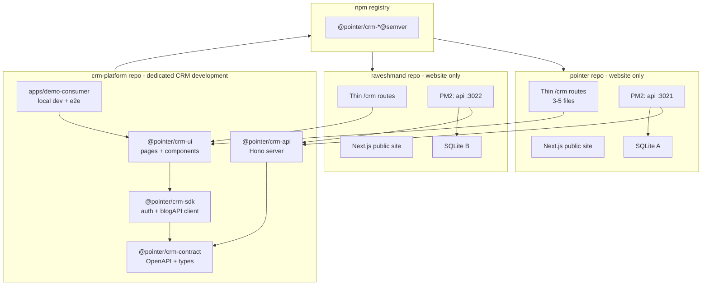
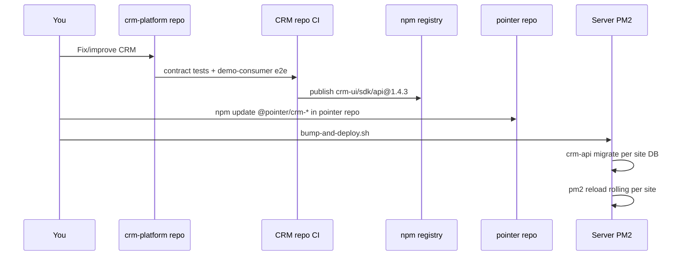

# Central CRM Development Plan

## Current State

Your CRM is **embedded and copy-pasted**, not shared:


| Layer      | Live code                                                                     | Stale copy                                |
| ---------- | ----------------------------------------------------------------------------- | ----------------------------------------- |
| UI         | `[src/app/crm/](src/app/crm/)` + `[src/components/crm/](src/components/crm/)` | `[imp/adminpanel/](imp/adminpanel/)`      |
| API client | `[src/lib/auth.ts](src/lib/auth.ts)`, `[src/lib/blog.ts](src/lib/blog.ts)`    | duplicates in `imp/adminpanel/src/lib/`   |
| API server | `[api-worker/](api-worker/)`                                                  | duplicate in `imp/adminpanel/api-worker/` |


Each site today is a full redeploy of this repo (or a manual copy from `imp/adminpanel/`). There is **no API versioning**, **no contract tests**, and **no semver boundary** — so any CRM improvement risks breaking live sites.

Your target hosting model (`[docs/deployment/WSL-PREP.md](docs/deployment/WSL-PREP.md)`): **one server, PM2 + Caddy, one SQLite DB per site, no Docker**. That fits a **shared-code, per-instance API** model well.

---

## Execution checklist (live progress)

Work in `F:\code\crm-platform`. Copy from `F:\code\pointer`. Do not modify pointer until Step 11.

| Step | Task | Status |
|------|------|--------|
| **1** | Create empty `crm-platform` repo on GitHub | **Done** |
| **2** | Clone to `F:\code\crm-platform` | **Done** |
| **3** | Scaffold pnpm workspace + first commit | **Next** |
| **4** | Extract `@pointer/crm-api` from `pointer/api-worker/` | Pending |
| **5** | Add `@pointer/crm-contract` (OpenAPI + generated types) | Pending |
| **6** | Extract `@pointer/crm-sdk` (auth, blog, config, types) | Pending |
| **7** | Extract `@pointer/crm-ui` (CRM pages + editor/AI components) | Pending |
| **8** | Create `apps/demo-consumer` for local dev + e2e | Pending |
| **9** | Verify all CRM flows in demo-consumer | Pending |
| **10** | Publish `@pointer/crm-*@0.1.0` | Pending |
| **11** | Convert `pointer` to thin package consumer (one PR) | Pending |
| **12** | Add CI guardrails (contract tests, publish on tag) | Pending |
| **13** | Migrate other sites; retire `imp/adminpanel/` | Pending |

Detailed commands for Steps 3–13 are in **Phase 0** below.

---

## How to continue the plan in `crm-platform` (from `pointer`)

The plan file lives in **Cursor's global plans folder** (`~/.cursor/plans/`), not inside `pointer`. Your new repo `F:\code\crm-platform` is still empty — you need to **switch workspace** and **carry the plan context** into that repo.

### Option A — Switch workspace + new chat (simplest)

1. **Open the CRM repo in Cursor**
   - `File → Open Folder…` → `F:\code\crm-platform`
   - Or a new Cursor window pointed at that folder

2. **Copy the plan into the CRM repo** (so it is versioned and `@`-mentionable):
   - Copy `C:\Users\adelf\.cursor\plans\central_crm_package_8f07d520.plan.md`
   - To `F:\code\crm-platform\docs\EXTRACTION-PLAN.md`
   - Commit it: `docs: add CRM extraction plan`

3. **Start a new Agent chat** in the `crm-platform` workspace and say:
   > Execute Step 3 from `@docs/EXTRACTION-PLAN.md`. Source files to copy live in sibling folder `F:\code\pointer`. Do not modify pointer until Step 11.

4. Keep **both folders** on disk — the agent reads from `F:\code\pointer` but writes only to `F:\code\crm-platform`.

### Option B — Multi-root workspace (best while extracting)

Open **both repos in one window** so copy operations are easy:

1. `File → Add Folder to Workspace…` → add `F:\code\crm-platform`
2. `File → Save Workspace As…` → e.g. `F:\code\pointer-crm.code-workspace`
3. Put the plan at `crm-platform/docs/EXTRACTION-PLAN.md` (same as Option A)
4. Agent chat can reference files from either root; rule: **edit crm-platform only** until Step 11

### Option C — Move this chat to the new root (keep conversation)

If you want to **continue this same chat** in `crm-platform`:

- Ask the agent: *"Move workspace to F:\code\crm-platform"* — it can use Cursor's `move_agent_to_root` so terminals and file tree default to the CRM repo.
- Then copy the plan into `docs/EXTRACTION-PLAN.md` and proceed with Step 3.

### What to put in `crm-platform` first (Step 3 reminder)

Before extraction, the CRM repo needs at least:

```
F:\code\crm-platform\
├── docs/EXTRACTION-PLAN.md    ← copy plan here
├── pnpm-workspace.yaml
├── package.json
├── packages/contract/src/
├── packages/sdk/src/
├── packages/ui/src/
├── packages/api/src/
└── apps/demo-consumer/
```

### When you return to `pointer` (Step 11 only)

- Open `F:\code\pointer` (or the multi-root workspace)
- Branch: `feat/use-crm-packages`
- Install published `@pointer/crm-*` packages and delete extracted files
- Until then, **all CRM commits go to `crm-platform`**, not `pointer`

---

## Target Architecture

**Two-repo model:** CRM is developed entirely in a **dedicated repo**. Each website (pointer, raveshmand, aidra.care, …) is a **separate repo** that installs published CRM packages — it never contains CRM source code.




**Black-box boundary:** website repos only depend on published `@pointer/crm-ui` + `@pointer/crm-sdk` (and run `@pointer/crm-api` as a PM2 process). They never import CRM source, fork `api-worker`, or copy from `imp/adminpanel/`.

---

## Repo Boundaries


| Repo                                              | Purpose               | Contains                                                                         |
| ------------------------------------------------- | --------------------- | -------------------------------------------------------------------------------- |
| `**crm-platform**` (new, dedicated)               | All CRM development   | UI, SDK, API, contract, migrations, CRM e2e tests, publish CI                    |
| `**pointer**` (existing)                          | pointer.ir website    | Public pages, brand, thin `/crm` shell, site env, its SQLite                     |
| **Other site repos**                              | Each brand's website  | Same thin-consumer pattern as pointer                                            |
| **Server ops** (optional 3rd repo or docs folder) | Deployment automation | Caddy configs, PM2 ecosystem files, `bump-and-deploy.sh` inventory of site paths |


**Why a separate CRM repo:**

- CRM evolves independently of any one website's marketing changes
- One CI pipeline, one changelog, one semver line for all consumers
- Website repos stay small and focused; no risk of accidental CRM edits in site PRs
- `pointer` becomes the first **consumer** to validate releases, not the **source** of CRM code

---

## Phase 0 — How to Create the CRM Repo from Mixed Code

Pointer today is **one repo with three concerns blended together**. The goal is not to "split git history perfectly on day one" — it is to **classify every file, copy CRM code into a new repo, restructure it into packages, then slim pointer down to a consumer**.

### Recommended approach: copy + restructure (not git subtree split)


| Approach                               | When to use                                                                                  |
| -------------------------------------- | -------------------------------------------------------------------------------------------- |
| **Copy + restructure** (recommended)   | Code must become npm packages with new import paths anyway; fastest path to working packages |
| `**git filter-repo` / subtree split**  | Optional later if you want CRM-only git blame/history in the new repo                        |
| **Big-bang delete from pointer first** | Never — pointer must keep working until packages are published and verified                  |


Do **not** copy `[imp/adminpanel/](imp/adminpanel/)` — it is a stale fork. Extract only from the live paths under `src/` and `api-worker/`.

---

### Step 1 — Classify every file before moving anything

Sort pointer files into four buckets:

**A. Move entirely to CRM repo (`@pointer/crm-api`)**


| Source in pointer                                                      | Destination               |
| ---------------------------------------------------------------------- | ------------------------- |
| `[api-worker/](api-worker/)`                                           | `packages/api/`           |
| `[database/schema.sql](database/schema.sql)` + migrations              | `packages/api/database/`  |
| `[tests/e2e/frontend.test.js](tests/e2e/frontend.test.js)` (CRM flows) | `apps/demo-consumer/e2e/` |


**B. Move to CRM repo (`@pointer/crm-sdk`)**


| Source in pointer                                                | Destination                                       | Notes                                                                  |
| ---------------------------------------------------------------- | ------------------------------------------------- | ---------------------------------------------------------------------- |
| `[src/lib/auth.ts](src/lib/auth.ts)`                             | `packages/sdk/src/auth.ts`                        | CRM + login                                                            |
| `[src/lib/blog.ts](src/lib/blog.ts)`                             | `packages/sdk/src/blog.ts`                        | Used by public blog **and** CRM — both import from SDK after migration |
| `[src/lib/config.ts](src/lib/config.ts)`                         | `packages/sdk/src/config.ts`                      |                                                                        |
| `[src/types/blog.ts](src/types/blog.ts)`                         | `packages/contract/` or `packages/sdk/src/types/` |                                                                        |
| `[src/lib/ai-completion.ts](src/lib/ai-completion.ts)`           | `packages/sdk/src/ai.ts`                          | If CRM-only                                                            |
| `[src/lib/blog-import-mapper.ts](src/lib/blog-import-mapper.ts)` | `packages/sdk/src/`                               | CRM import feature                                                     |


**C. Move to CRM repo (`@pointer/crm-ui`)**


| Source in pointer                                                                    | Destination                                                   |
| ------------------------------------------------------------------------------------ | ------------------------------------------------------------- |
| `[src/app/crm/](src/app/crm/)`                                                       | `packages/ui/src/` (restructure routes → exported components) |
| `[src/components/crm/](src/components/crm/)`                                         | `packages/ui/src/components/`                                 |
| `[src/app/login/page.tsx](src/app/login/page.tsx)`                                   | `packages/ui/src/pages/login.tsx`                             |
| `[src/components/blog/BlogEditor.tsx](src/components/blog/BlogEditor.tsx)`           | `packages/ui/src/components/blog/`                            |
| `[src/components/blog/AI*.tsx](src/components/blog/)`                                | `packages/ui/src/components/blog/`                            |
| `[src/components/blog/UrlImportPanel.tsx](src/components/blog/UrlImportPanel.tsx)`   | `packages/ui/`                                                |
| `[src/components/blog/ImagePicker.tsx](src/components/blog/ImagePicker.tsx)`         | `packages/ui/`                                                |
| `[src/components/blog/BlogImportModal.tsx](src/components/blog/BlogImportModal.tsx)` | `packages/ui/`                                                |
| `[src/components/AIAssistantModal.tsx](src/components/AIAssistantModal.tsx)`         | `packages/ui/`                                                |
| `[src/contexts/AIContentContext.tsx](src/contexts/AIContentContext.tsx)`             | `packages/ui/`                                                |


**D. Stay in pointer (site repo) — update imports only**


| Stays in pointer                                                                             | After migration imports from                |
| -------------------------------------------------------------------------------------------- | ------------------------------------------- |
| `[src/app/blog/*](src/app/blog/)` public pages                                               | `@pointer/crm-sdk` (`blogAPI`, `blogUtils`) |
| `[src/components/blog/BlogContentRenderer.tsx](src/components/blog/BlogContentRenderer.tsx)` | stays local (public display)                |
| `[src/components/blog/SearchForm.tsx](src/components/blog/SearchForm.tsx)`                   | stays local                                 |
| `[src/components/blog/BlogViewTracker.tsx](src/components/blog/BlogViewTracker.tsx)`         | stays local                                 |
| `[src/app/page.tsx](src/app/page.tsx)`, marketing, sitemap                                   | `@pointer/crm-sdk` for blog reads           |
| `[ConditionalHeader.tsx](src/components/navigation/ConditionalHeader.tsx)`, robots, CSP      | stays local                                 |


This split handles the **mixed `blog.ts` problem**: the file moves to the SDK package once; pointer's public blog pages change one import line (`@/lib/blog` → `@pointer/crm-sdk`). No duplication.

---

### Step 1–2 — Create GitHub repo + clone locally ✅ Done

- [x] GitHub: new empty repo `crm-platform`
- [x] Local: `git clone` → `F:\code\crm-platform`

---

### Step 3 — Scaffold workspace + first commit (NEXT)

Run in `F:\code\crm-platform`:

```powershell
cd F:\code\crm-platform

# Workspace folders
New-Item -ItemType Directory -Force -Path packages/contract/src, packages/sdk/src, packages/ui/src, packages/api/src
New-Item -ItemType Directory -Force -Path apps/demo-consumer, scripts, .github/workflows

pnpm init
```

Create `pnpm-workspace.yaml` at repo root:

```yaml
packages:
  - 'packages/*'
  - 'apps/*'
```

Create root `package.json` scripts (merge into pnpm init output):

```json
{
  "name": "crm-platform",
  "private": true,
  "scripts": {
    "dev": "turbo run dev",
    "build": "turbo run build",
    "test": "turbo run test",
    "lint": "turbo run lint"
  },
  "devDependencies": {
    "turbo": "^2.0.0",
    "typescript": "^5.0.0"
  }
}
```

Add minimal `package.json` per package (names only for now):

| Path | `"name"` |
|------|----------|
| `packages/contract/package.json` | `@pointer/crm-contract` |
| `packages/sdk/package.json` | `@pointer/crm-sdk` |
| `packages/ui/package.json` | `@pointer/crm-ui` |
| `packages/api/package.json` | `@pointer/crm-api` |

Add root `.gitignore` (node_modules, .env, data/*.db, dist, .turbo).

```powershell
git add .
git commit -m "chore: scaffold crm-platform workspace"
git push origin main
```

**Done when:** repo has workspace layout, pushes cleanly, pointer unchanged.

---

### Step 4 — Extract `@pointer/crm-api`

Copy from pointer, reshape, verify API runs alone.

```powershell
# Copy API source
Copy-Item -Recurse -Force F:\code\pointer\api-worker\* F:\code\crm-platform\packages\api\
Copy-Item -Recurse -Force F:\code\pointer\database F:\code\crm-platform\packages\api\database

# Dev database (copy from pointer, do not move)
New-Item -ItemType Directory -Force -Path F:\code\crm-platform\data
Copy-Item F:\code\pointer\data\database.db F:\code\crm-platform\data\database.db
```

In `packages/api/package.json`:

- Set `"name": "@pointer/crm-api"`
- Add bin: `"crm-api": "./dist/cli.js"`
- Add scripts: `"dev": "tsx watch src/server.ts"`, `"build": "tsc"`, `"start": "node dist/cli.js"`
- Copy dependencies from `pointer/api-worker/package.json`

Add CLI (`packages/api/src/cli.ts`):

```
crm-api start --port 3021 --db ./data/database.db
crm-api migrate --db ./data/database.db
```

Fix imports paths inside `packages/api/` (no `@/` aliases — use relative imports).

```powershell
cd F:\code\crm-platform\packages\api
pnpm install
pnpm dev
# Smoke: curl http://localhost:3021/admin/verify (expect 401/unauthorized, not connection refused)
```

```powershell
git add packages/api data/.gitkeep
git commit -m "feat(api): extract api-worker into @pointer/crm-api"
git push
```

**Do not delete** `pointer/api-worker/` yet.

---

### Step 5 — Add `@pointer/crm-contract`

- Create `packages/contract/openapi.yaml` documenting endpoints from `pointer/api-worker/app.ts`
- Add `openapi-typescript` devDep; script `"generate": "openapi-typescript openapi.yaml -o src/types.ts"`
- Add `/v1/` route aliases in API (mount same handlers under `/v1/admin/*`, etc.)
- SDK and API will import types from `@pointer/crm-contract`

```powershell
git commit -m "feat(contract): add OpenAPI spec and v1 route aliases"
git push
```

---

### Step 6 — Extract `@pointer/crm-sdk`

Copy from pointer:

| Source | Destination |
|--------|-------------|
| `pointer/src/lib/auth.ts` | `packages/sdk/src/auth.ts` |
| `pointer/src/lib/blog.ts` | `packages/sdk/src/blog.ts` |
| `pointer/src/lib/config.ts` | `packages/sdk/src/config.ts` |
| `pointer/src/types/blog.ts` | `packages/sdk/src/types/blog.ts` |
| `pointer/src/lib/ai-completion.ts` | `packages/sdk/src/ai.ts` |
| `pointer/src/lib/blog-import-mapper.ts` | `packages/sdk/src/blog-import-mapper.ts` |

- Replace `@/types/blog` → `@pointer/crm-contract` or local `./types/blog`
- Export: `authService`, `useAuth`, `blogAPI`, `blogUtils`, `getApiUrl`
- `"main": "./src/index.ts"` with barrel export

```powershell
git commit -m "feat(sdk): extract auth and blog client into @pointer/crm-sdk"
git push
```

---

### Step 7 — Extract `@pointer/crm-ui`

Copy CRM UI + editor-only components (see file classification table in Phase 0):

```powershell
Copy-Item -Recurse F:\code\pointer\src\app\crm F:\code\crm-platform\packages\ui\src\crm
Copy-Item -Recurse F:\code\pointer\src\components\crm F:\code\crm-platform\packages\ui\src\components\crm
# + BlogEditor, AI*, UrlImportPanel, ImagePicker, BlogImportModal, AIAssistantModal, AIContentContext
```

- Rewrite imports: `@/lib/auth` → `@pointer/crm-sdk`, `@/components/blog/BlogEditor` → internal paths
- Build **`CrmCatchAll`** exported component for host sites' `[[...slug]]` route
- Export **`CrmLoginPage`**, **`CrmRootLayout`**
- TipTap/Radix/lucide as dependencies or peerDependencies in `packages/ui/package.json`

```powershell
git commit -m "feat(ui): extract CRM pages and editor into @pointer/crm-ui"
git push
```

---

### Step 8 — Create `apps/demo-consumer`

Minimal Next.js app to run CRM without pointer:

```
apps/demo-consumer/
├── src/app/
│   ├── crm/[[...slug]]/page.tsx   → import { CrmCatchAll } from '@pointer/crm-ui'
│   ├── login/page.tsx             → import { CrmLoginPage } from '@pointer/crm-ui'
│   └── layout.tsx
├── .env.local                     → NEXT_PUBLIC_API_BASE_URL=http://localhost:3021
├── next.config.ts                 → transpilePackages: ['@pointer/crm-ui', '@pointer/crm-sdk']
└── package.json
```

Copy e2e tests from `pointer/tests/e2e/frontend.test.js` → `apps/demo-consumer/e2e/`.

```powershell
git commit -m "feat(demo): add demo-consumer app for local CRM dev"
git push
```

---

### Step 9 — Verify in isolation

```powershell
cd F:\code\crm-platform
pnpm install
pnpm --filter @pointer/crm-api dev      # :3021
pnpm --filter demo-consumer dev         # :3030
pnpm test
```

Manual checklist:

- [ ] Login (password + magic link)
- [ ] Dashboard stats
- [ ] Blog CRUD + image upload
- [ ] Contacts / newsletters / appointments
- [ ] API keys page

**Gate:** do not touch pointer until all pass.

---

### Step 10 — Publish v0.1.0

- Configure GitHub Packages (or npm) for `@pointer` scope
- Add `publish.yml` workflow: publish all packages on git tag `v*`
- Align versions across packages (e.g. all `0.1.0`)

```powershell
git tag v0.1.0
git push origin v0.1.0
```

---

### Step 11 — Convert pointer to thin consumer (one PR)

In `F:\code\pointer` on a branch:

1. Add dependencies: `@pointer/crm-ui`, `@pointer/crm-sdk`, `@pointer/crm-api`
2. Add `transpilePackages` in `next.config.ts`
3. Replace `src/app/crm/**` with thin re-exports from `@pointer/crm-ui`
4. Replace `src/app/login/page.tsx` with re-export
5. Update public blog: `@/lib/blog` → `@pointer/crm-sdk`
6. Delete: `api-worker/`, old CRM files, CRM-only blog components, `imp/adminpanel/`
7. Update PM2/Caddy to run `crm-api` from `node_modules`
8. Smoke-test public site + `/crm`

---

### Step 12 — CI guardrails

In `crm-platform`:

- `ci.yml`: lint + build + contract tests + e2e on every PR
- Block publish if OpenAPI validation or e2e fails
- Add changesets for semver changelog

---

### Step 13 — Other sites + deploy tooling

- Migrate raveshmand.com, aidra.care, etc. (same thin-consumer pattern as pointer)
- Add `scripts/bump-and-deploy.sh` + site inventory file for server
- Document PM2/Caddy templates per site
- Delete `imp/adminpanel/` from pointer; link to CRM repo install docs

---

### Step 14 — Optional: preserve git history

Only after everything works. If blame/history matters:

```bash
# Run from pointer repo — exports CRM paths with history into new repo
git filter-repo --path api-worker/ --path src/app/crm/ --path src/lib/auth.ts \
  --path src/lib/blog.ts --force

# Or use git subtree split (alternative)
git subtree split --prefix=api-worker -b crm-api-history
# Push crm-api-history branch to crm-platform repo
```

This is **cosmetic** — most teams skip it.

**Folder layout on your machine:**

```
F:\code\
├── pointer\          # unchanged until Step 11
└── crm-platform\     # all CRM work here (Steps 3–13)
```

---

### Handling the transition period

While extraction is in progress, both repos coexist safely:


| Period   | pointer repo          | crm-platform repo                      |
| -------- | --------------------- | -------------------------------------- |
| Week 1–2 | Unchanged, production | Scaffold + API + SDK                   |
| Week 3   | Unchanged             | UI + demo-consumer + e2e green         |
| Week 4   | Consumer PR merged    | v0.1.0 published; ongoing CRM dev here |
| After    | Public site only      | All CRM features                       |


**Rule:** once pointer converts to packages, **never copy CRM code back into pointer**. All CRM fixes go to `crm-platform`, then bump package version on sites.

---

## Phase 1 — Create the Dedicated CRM Repo

Create a **new standalone repo** (`crm-platform`). Do **not** fold CRM into the pointer repo or convert pointer into a workspace root.

```
crm-platform/                    # NEW dedicated repo
├── packages/
│   ├── contract/                # OpenAPI spec + generated TS types
│   ├── sdk/                     # auth.ts, blog.ts, config, types (extracted from pointer)
│   ├── ui/                      # CRM pages + components (extracted from pointer)
│   └── api/                     # Hono api-worker (extracted from pointer)
├── apps/
│   └── demo-consumer/           # Minimal Next.js app for local dev + e2e (replaces in-repo reference site)
├── scripts/
│   ├── migrate-all-sites.sh     # Run migrations across server site list
│   └── bump-and-deploy.sh       # Bump package versions on all deployed sites
├── .github/workflows/
│   ├── ci.yml                   # test + contract validation on every PR
│   └── publish.yml              # publish @pointer/crm-* on release tag
└── package.json                 # pnpm workspaces + Turborepo
```

**Initial extraction source:** copy CRM code **out of** `[pointer](F:\code\pointer)` (`src/app/crm/`, `src/lib/auth.ts`, `api-worker/`, etc.) into this new repo, then delete it from pointer once the packages work.

### Package responsibilities

`**@pointer/crm-contract**` (source of truth)

- OpenAPI 3 spec documenting every endpoint CRM uses today (`/admin/*`, `/blog/*`, `/auth/magic/*`, `/api/external/*`, `/ai/*`)
- Generated TypeScript request/response types consumed by SDK and API
- Versioned independently: `contract@1.x` = stable API surface

`**@pointer/crm-sdk**`

- Move `[src/lib/auth.ts](src/lib/auth.ts)`, `[src/lib/blog.ts](src/lib/blog.ts)`, `[src/lib/config.ts](src/lib/config.ts)`, `[src/types/blog.ts](src/types/blog.ts)`
- All HTTP calls go through typed functions that match the contract
- Reads `NEXT_PUBLIC_API_BASE_URL` from the host site env
- Exports `CrmProvider` context if UI needs shared config (site name, feature flags)

`**@pointer/crm-ui**`

- Move all of `[src/app/crm/](src/app/crm/)` and `[src/components/crm/](src/components/crm/)`
- Also move shared dependencies: blog editor components used only by CRM, or declare them as peer deps
- Export:
  - `CrmLayout`, page components per route
  - `**CrmCatchAll**` — a single router component for `[...slug]` (minimizes per-site files)
  - `crmRouteManifest` — list of routes for sitemap/robots helpers
- Peer deps: `next`, `react`, `react-dom`, tailwind-compatible UI libs

`**@pointer/crm-api**`

- Move `[api-worker/](api-worker/)` as publishable package with CLI: `crm-api start --port 3021 --db /path/to/db`
- Include `[database/schema.sql](database/schema.sql)` + migration runner
- Each site PM2 process gets its own `DATABASE_PATH` and `JWT_SECRET`

---

## Phase 2 — API Guardrails (the black box)

These rules prevent CRM improvements from breaking live sites:

### 1. URL versioning

Add a `/v1/` prefix to all CRM-facing routes. Keep unversioned routes as aliases during transition:

```
/v1/admin/login     (new canonical)
/admin/login        (deprecated alias, removed in v2)
```

Implement in `[api-worker/app.ts](api-worker/app.ts)` by mounting the same handlers under both paths initially.

### 2. Semver policy


| Change type                      | Contract bump | SDK/UI bump | Site action                 |
| -------------------------------- | ------------- | ----------- | --------------------------- |
| Bug fix, internal refactor       | patch         | patch       | optional update             |
| New optional field/endpoint      | minor         | minor       | optional update             |
| Remove/rename field, change auth | **major**     | major       | required coordinated deploy |


### 3. Response envelope stability

Every API response keeps a consistent shape:

```json
{ "success": true, "data": { ... }, "meta": { "apiVersion": "1.2.0" } }
{ "success": false, "error": { "code": "INVALID_TOKEN", "message": "..." } }
```

Existing handlers in `[api-worker/index.ts](api-worker/index.ts)` mostly follow `{ success, ... }` already — formalize and never remove top-level keys in minor releases.

### 4. Deprecation headers

When changing behavior, old routes return:

```
Deprecation: true
Sunset: Sat, 01 Jan 2028 00:00:00 GMT
Link: </v1/admin/login>; rel="successor-version"
```

### 5. Contract tests (CI gate)

Before publishing any package version:

- **Schema validation:** every handler response validated against OpenAPI spec (use `ajv` or `@apidevtools/swagger-parser`)
- **Consumer tests:** SDK integration tests against a test SQLite DB
- **E2E:** move/adapt `[tests/e2e/frontend.test.js](tests/e2e/frontend.test.js)` into CRM repo's `apps/demo-consumer/`; pointer repo drops CRM-specific e2e after migration

### 6. Database migrations (backward compatible)

- Migrations in `packages/api/migrations/` numbered sequentially
- Rule: **expand → migrate → contract** (add nullable columns first; never drop/rename in same release as code that reads old shape)
- `crm-api migrate` runs automatically in deploy script before PM2 reload

### 7. External API keys (already started)

Your `[/api/external/blog/*](api-worker/index.ts)` + `X-API-Key` pattern is the right model for cross-site integrations. Extend the contract to cover these endpoints explicitly so external consumers are also protected.

---

## Phase 3 — Thin Site Integration

Each website keeps only a **host shell**. Example for Site A:

**Env** (`.env`):

```
NEXT_PUBLIC_API_BASE_URL=https://pointer.ir/api
CRM_PACKAGE_VERSION=1.4.2
JWT_SECRET=...
DATABASE_PATH=/home/sites/pointer/data/database.db
```

**Next.js config** — add transpilation:

```ts
// next.config.ts
transpilePackages: ['@pointer/crm-ui', '@pointer/crm-sdk'],
```

**Thin routes** (entire CRM in ~3 files):

```
src/app/crm/
  layout.tsx          → export { CrmRootLayout } from '@pointer/crm-ui'
  [[...slug]]/page.tsx → export { CrmCatchAll } from '@pointer/crm-ui'
src/app/login/page.tsx → export { CrmLoginPage } from '@pointer/crm-ui'
```

**Site-specific hooks** (keep in site repo, not package):

- `[ConditionalHeader.tsx](src/components/navigation/ConditionalHeader.tsx)` — hide header on `/crm/*`
- `[robots.ts](src/app/robots.ts)` — disallow `/crm/`
- `[public/_headers](public/_headers)` — CSP for `/crm/*`
- Public blog pages stay in the site; they use `@pointer/crm-sdk` only if needed for public reads

**Caddy** (one block per site):

```
pointer.ir {
  reverse_proxy /api/* localhost:3021
  reverse_proxy /* localhost:3020
}
raveshmand.com {
  reverse_proxy /api/* localhost:3022
  reverse_proxy /* localhost:3023
}
```

**PM2 ecosystem** (`ecosystem.config.js` per site):

```js
{ name: 'pointer-api',  script: 'crm-api', args: 'start --port 3021 --db ...' }
{ name: 'pointer-web',  script: 'node_modules/next/dist/bin/next', args: 'start -p 3020' }
```

---

## Phase 4 — Update Workflow (how you improve CRM once, roll to all sites)

All CRM development happens in `**crm-platform**`. Website repos only receive published package bumps.




`**scripts/bump-and-deploy.sh**` (lives in CRM repo; run from server against a site inventory file):

1. For each site in `/home/sites/*/`: `npm update @pointer/crm-ui @pointer/crm-sdk`
2. Run `crm-api migrate` against that site's SQLite
3. `pm2 reload <site>-api` then `pm2 reload <site>-web` (API first if contract changed)
4. Smoke test: `curl /v1/admin/verify`, login flow, one blog CRUD

**Zero-downtime rules:**

- Always deploy API with backward-compatible changes before bumping UI
- Use `pm2 reload` (graceful) not `restart`
- Roll one site at a time; if smoke test fails, pin previous package version

**Pinning for safety:** each site's `package.json` uses `"@pointer/crm-ui": "~1.4.0"` (tilde = auto patch, manual minor). Use exact pins (`1.4.3`) for production if you want full control.

---

## Phase 5 — Migration timeline (summary)

This is the short version; see **Phase 0** for the detailed file-by-file playbook.

1. **Scaffold `crm-platform`** — empty workspace (Step 2 in Phase 0)
2. **Extract API → contract → SDK → UI** — bottom-up, verify in demo-consumer (Steps 3–4)
3. **Publish v0.1.0** — first package release (Step 5)
4. **Convert pointer in one PR** — thin routes + delete extracted files (Step 6)
5. **Retire `imp/adminpanel/`** — delete from pointer; document install from CRM repo
6. **Migrate other site repos** — same consumer pattern, one at a time
7. **Optional** — git history split if you want blame preserved (Step 7)

`[pointer](F:\code\pointer)` stays production-ready until Step 4 is verified. It becomes the **first consumer**, not the CRM source repo.

---

## What Each Site Owns vs What Is Central


| Owned by site (never in package)        | Owned by CRM packages (central)    |
| --------------------------------------- | ---------------------------------- |
| Public marketing pages, brand, SEO      | `/crm/*` UI, login flow            |
| `NEXT_PUBLIC_SITE_URL`, theme overrides | Admin API handlers                 |
| Its own SQLite file + JWT secret        | Database schema + migrations       |
| Caddy vhost + PM2 ports                 | Auth logic, blog CRUD, AI features |
| robots, CSP, analytics exclusions       | Contract + SDK                     |


---

## Recommended Tooling

- **CRM repo:** pnpm workspaces + Turborepo (build/test cache across packages)
- **Website repos:** plain Next.js apps; no workspaces needed — just `@pointer/crm-ui` and `@pointer/crm-sdk` in `package.json`
- **Publishing:** GitHub Packages or npm private registry (`@pointer/`* scope); CRM repo CI publishes on git tag
- **Contract:** OpenAPI 3.1 + `openapi-typescript` for type generation
- **Testing:** Playwright e2e in CRM repo's `demo-consumer`; API contract tests in CRM repo CI
- **Changelog:** changesets or semantic-release in CRM repo only
- **Local dev:** `pnpm dev` in CRM repo runs demo-consumer + API together; no need to open pointer for CRM work

---

## Risks and Mitigations


| Risk                                        | Mitigation                                                                                   |
| ------------------------------------------- | -------------------------------------------------------------------------------------------- |
| Next.js App Router packages are tricky      | Use `transpilePackages`, export client components explicitly, test in reference site CI      |
| UI package pulls heavy deps (TipTap, Radix) | Declare as peerDependencies; site installs once                                              |
| One bad API deploy breaks all sites         | Per-site DB isolation + semver + rolling deploy + smoke tests                                |
| Sites drift to different CRM versions       | `bump-and-deploy.sh` + optional server cron that alerts on version mismatch                  |
| Tailwind styles missing in package          | Ship CRM with its own CSS entry or use Tailwind `@source` in site config pointing at package |


---

## Success Criteria

- CRM is developed in a **dedicated repo** (`crm-platform`), completely separate from pointer and other site repos
- You change CRM in one place, publish packages, run **one deploy script** across all sites
- Each website repo's `/crm/` folder shrinks to **≤5 files** (thin consumer shell only)
- API breaking changes are **impossible to ship accidentally** (CRM repo CI contract gate)
- Rolling update completes with **no login/blog downtime** on unaffected sites
- `imp/adminpanel/` copy-paste workflow is **retired**; CRM repo is the single source of truth

